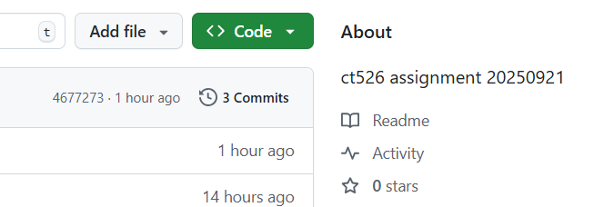
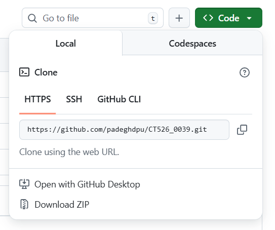

# CT526_0039

## To do clone source code form Github

1. create a local folder on your machine which you desire to keep the source code 

2. Go to Github website by using a provided a URL Link to Github as below 

```
    https://github.com/padeghdpu/CT526_0039

```      

3. You will be redirect to the github portal 

    - 3.1 click on the green button "\<>code" .


              


    - 3.2 ensure that the "HTTPS" tab has been selected ( it's active )  .


        


    - 3.3 To make a copy the url link as below or click on the "copy" icon on right hand side ( looks like double square icon)  
        
```
    https://github.com/padeghdpu/CT526_0039.git      

```


4. Back to you machine and open command prompt 

5. To change directory ( by using "CD" command )  to the folder as you created in the beginning .  

6. input command git clone and follow by paste the copied url link ( such as by right click on mouse ) as below

```
    git clone https://github.com/padeghdpu/CT526_0039.git

```

7. Press "Enter" button
 
8. Download source code operation should be started .

9. Once it's finished ,  ensure that all of source code to be found in there . 

10. To run program by enter command 

```
    python main.py

```
